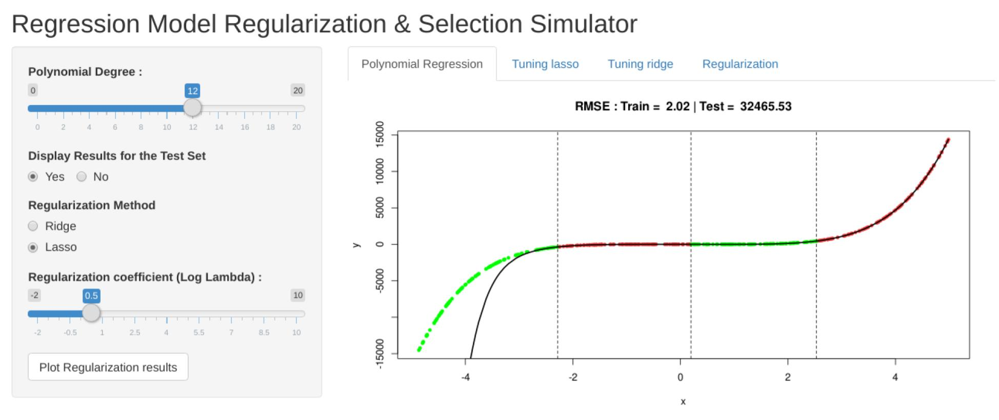

# A-Pedagogical-Regression-Models-Regularization-Simulator
A simple Shiny (R) Application for beginners to understand basic ideas in ML like Overfitting, Underfitting &amp; Regularization

## UI Screenshot  
### Application Architecture

